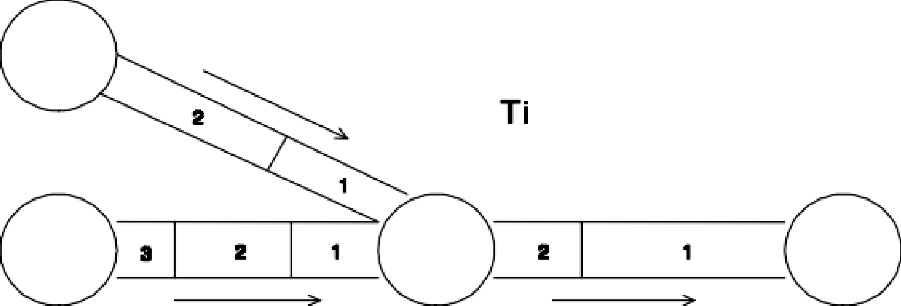
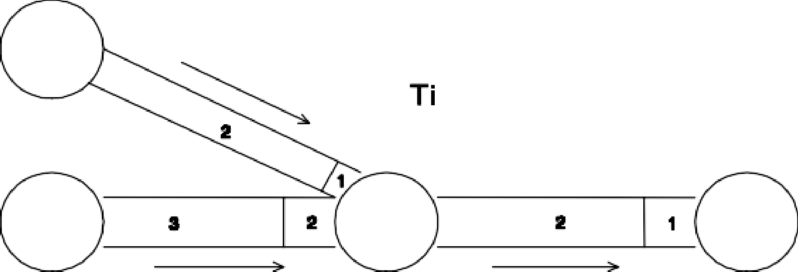
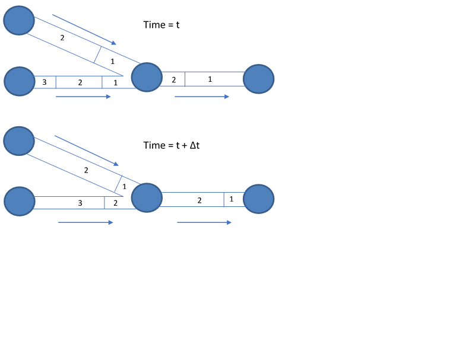

.. raw:: latex

    \clearpage

D. ANALYSIS ALGORITHMS
======================

Hydraulics
~~~~~~~~~~

  The method used in EPANET to solve the flow continuity and headloss
  equations that characterize the hydraulic state of the pipe network
  at a given point in time can be termed a hybrid node-loop approach.
  Todini and Pilati (1987) and later Salgado et al. (1988) chose to
  call it the "Gradient Method". Similar approaches have been described
  by Hamam and Brameller (1971) (the "Hybrid Method) and by Osiadacz
  (1987) (the "Newton Loop-Node Method"). The only difference between
  these methods is the way in which link flows are updated after a new
  trial solution for nodal heads has been found. Because Todini's
  approach is simpler, it was chosen for use in EPANET.

  Assume we have a pipe network with N junction nodes and NF fixed
  grade nodes (tanks and reservoirs). Let the flow-headloss relation in
  a pipe between nodes i and j be given as: :math:`\boldsymbol{\nabla}` is the nabla operator.

  .. math:: H _{i} -H _{j} =h _{ij} =rQ _{ij}^{n} +mQ _{ij}^{2} ~~~~~~
     (D.1)

  where *H* = nodal head, *h* = headloss, *r* = resistance coefficient,
  *Q* = flow rate, *n* = flow exponent, and *m* = minor loss
  coefficient. The value of the resistance coefficient will depend on
  which friction headloss formula is being used (see below). For pumps,
  the headloss (negative of the head gain) can be represented by a
  power law of the form

  .. math:: { h}_{ij }={ -ω}^{ 2} ( { h}_{0}-r { ( { Q}_{ij }/ω   )}^{2 }   )

  where *h\ 0* is the shutoff head for the pump, ω is a relative speed
  setting, and r and n are the pump curve coefficients. The second set
  of equations that must be satisfied is flow continuity around all
  nodes:

  .. math:: \sum_{j} {Q}_{ij }-{ D}_{i }=0  ~~~~~~~\text{  for i = 1,... N. }~~~~~~
     (D.2)

  where *D\ i* is the flow demand at node i and by convention, flow
  into a node is positive. For a set of known heads at the fixed grade
  nodes, we seek a solution for all heads *H\ i* and flows *Q\ ij* that
  satisfy Eqs. (D.1) and (D.2).

  The Gradient solution method begins with an initial estimate of flows
  in each pipe that may not necessarily satisfy flow continuity. At
  each iteration of the method, new nodal heads are found by solving
  the matrix equation:

  .. math:: \boldsymbol{AH} = \boldsymbol{F} ~~~~~~
     (D.3)

  where **A** = an (NxN) Jacobian matrix, **H** = an (Nx1) vector of
  unknown nodal heads, and **F** = an (Nx1) vector of right hand side
  terms

  The diagonal elements of the Jacobian matrix are:

  .. math:: { A}_{ij }= \sum_{j} { P}_{ij }

  while the non-zero, off-diagonal terms are:

  .. math:: { A}_{ij }= -{ P}_{ij }

  where *p\ ij* is the inverse derivative of the headloss in the link
  between nodes i and j with respect to flow. For pipes,

  .. math:: { P}_{ij }= \frac{ 1}{nr {{   | { Q}_{ji }   |}^{ n-1}}+2m   | { Q}_{ji }   |}

  while for pumps

  .. math:: { P}_{ij }=\frac{ 1} {n{ ω}^{2 }r{ ({ Q}_{ij }/ω )}^{n-1 }}

  Each right hand side term consists of the net flow imbalance at a
  node plus a flow correction factor:

  .. math:: { F}_{i }=  ( \sum_{{ j}}{ Q}_{ij }-{ D}_{i }  )+ \sum_{{ j}}{ y}_{ij } + \sum_{{ f}}{ P}_{ij }{ H}_{f }

  where the last term applies to any links connecting node i to a fixed
  grade node f and the flow correction factor *y\ ij* is:

  .. math:: { y}_{ij }={ P}_{ij }  ( r{   | { Q}_{ij }   |}^{n }  +m{   | { Q}_{ij }   |}^{2 }   )sgn ( { Q}_{ij }   )

  for pipes and

  .. math:: { y}_{ij }={- P}_{ij }{ ω}^{ 2}  ( { h}_{0 } -r {   ({ Q}_{ij }/ω    )}^{n }  )

  for pumps, where sgn(x) is 1 if x > 0 and -1 otherwise. (*Q\ ij* is
  always positive for pumps.)

  After new heads are computed by solving Eq. (D.3), new flows are
  found from:

  .. math:: {Q}_{ij }={Q}_{ij } - ( { y}_{ij } -{ P}_{ij}  ({ H}_{i }- { H}_{j } ) )  ~~~~~~
     (D.4)

  If the sum of absolute flow changes relative to the total flow in all
  links is larger than some tolerance (e.g., 0.001), then Eqs. (D.3)
  and (D.4) are solved once again. The flow update formula (D.4) always
  results in flow continuity around each node after the first
  iteration.

  EPANET implements this method using the following steps:

  1. The linear system of equations D.3 is solved using a sparse matrix
     method based on node re-ordering (George and Liu, 1981). After re-
     ordering the nodes to minimize the amount of fill-in for matrix A, a
     symbolic factorization is carried out so that only the non-zero
     elements of A need be stored and operated on in memory. For extended
     period simulation this re-ordering and factorization is only carried
     out once at the start of the analysis.

  2. For the very first iteration, the flow in a pipe is chosen equal to
     the flow corresponding to a velocity of 1 ft/sec, while the flow
     through a pump equals the design flow specified for the pump. (All
     computations are made with head in feet and flow in cfs).

  3. The resistance coefficient for a pipe (*r*) is computed as described
     in Table 3.1. For the Darcy-Weisbach headloss equation, the friction
     factor *f* is computed by different equations depending on the flow’s
     Reynolds Number (Re):

     Hagen – Poiseuille formula for Re < 2,000 (Bhave, 1991):

     .. math:: f= \frac{ 64} {Re }

     Swamee and Jain approximation to the Colebrook - White equation for
     Re > 4,000 (Bhave, 1991):

     .. math:: f= \frac{0.25} {{ [ Ln   ( \frac{ ε}{3.7d }    +\frac{ 5.74}{{ Re}^{0.9 } }) ] }^{ 2} }

     Cubic Interpolation From Moody Diagram for 2,000 < Re < 4,000
     (Dunlop, 1991):

     .. math:: f=  ( X1+R  ( X2+R   (X3+X4    )   )   )
     .. math:: R= \frac{ Re} {2000 }
     .. math:: X1=7FA-FB
     .. math:: X2=0.128-17FA+2.5FB
     .. math:: X3=-0.128+13FA-2FB
     .. math:: X4=R   ( 0.032-3FA+0.5FB   )
     .. math:: FA={   ( Y3   )}^{-2 }
     .. math:: FB=FA   ( 2-\frac{ 0.00514215}  {  ( Y2   )  ( Y3   ) }   )
     .. math:: Y2= \frac{ ε} {3.7d }+\frac{ 5.74}{{ Re}^{ 0.9} }
     .. math:: Y3=-0.86859 Ln   ( \frac{ ε}{ 3.7d}+\frac{ 5.74}{{ 4000}^{0.9 } }   )

     where *σ* = pipe roughness and *d* = pipe diameter.

  4. The minor loss coefficient based on velocity head (*K*) is converted
     to one based on flow (*m*) with the following relation:

     .. math:: m=\frac{ 0.02517K} {{ d}^{4 } }

  5. Emitters at junctions are modeled as a fictitious pipe between the
     junction and a fictitious reservoir. The pipe’s headloss parameters
     are *n* = (1/γ), *r* = (1/C):sup:`n`, and *m* = 0 where C is the
     emitter’s discharge coefficient and γ is its pressure exponent. The
     head at the fictitious reservoir is the elevation of the junction.
     The computed flow through the fictitious pipe becomes the flow
     associated with the emitter.

  6. Open valves are assigned an *r*-value by assuming the open valve acts
     as a smooth pipe (f = 0.02) whose length is twice the valve diameter.
     Closed links are assumed to obey a linear headloss relation with a
     large resistance factor, i.e., *h* = 10\ :sup:`8`\ *Q*, so that *p* =
     10\ :sup:`-8` and *y* = *Q*. For links where *(r+m)Q* <
     10\ :sup:`-7`, *p* = 10\ :sup:`7` and *y = Q/n*.

  7. Status checks on pumps, check valves (CVs), flow control valves, and
     pipes connected to full/empty tanks are made after every other
     iteration, up until the 10th iteration. After this, status checks are
     made only after convergence is achieved. Status checks on pressure
     control valves (PRVs and PSVs) are made after each iteration.

  8. During status checks, pumps are closed if the head gain is greater
     than the shutoff head (to prevent reverse flow). Similarly, check
     valves are closed if the headloss through them is negative (see
     below). When these conditions are not present, the link is re-opened.
     A similar status check is made for links connected to empty/full
     tanks. Such links are closed if the difference in head across the
     link would cause an empty tank to drain or a full tank to fill. They
     are re- opened at the next status check if such conditions no longer
     hold.

  9. Simply checking if *h* < 0 to determine if a check valve should be
     closed or open was found to cause cycling between these two states in
     some networks due to limits on numerical precision. The following
     procedure was devised to provide a more robust test of the status of
     a check valve (CV):

      ::

        if |h| > Htol then
          if h < -Htol then     status = CLOSED
          if Q < -Qtol then     status = CLOSED
          else                  status = OPEN

        else
          if *Q* < -Qtol then   status = CLOSED
          else                  status = unchanged

      where Htol = 0.0005 ft and Qtol = 0.001 cfs.

  10. If the status check closes an open pump, pipe, or CV, its flow is
      set to 10\ :sup:`-6` cfs. If a pump is re-opened, its flow is
      computed by applying the current head gain to its characteristic
      curve. If a pipe or CV is re- opened, its flow is determined by
      solving Eq. (D.1) for *Q* under the current headloss *h*, ignoring
      any minor losses.

  11. Matrix coefficients for pressure breaker valves (PBVs) are set to
      the following: *p* = 10\ :sup:`8` and *y* = 10\ :sup:`8`\ Hset,
      where Hset is the pressure drop setting for the valve (in feet).
      Throttle control valves (TCVs) are treated as pipes with *r* as
      described in item 6 above and *m* taken as the converted value of
      the valve setting (see item 4 above).

  12. Matrix coefficients for pressure reducing, pressure sustaining, and
      flow control valves (PRVs, PSVs, and FCVs) are computed after all
      other links have been analyzed. Status checks on PRVs and PSVs are
      made as described in item 7 above. These valves can either be
      completely open, completely closed, or active at their pressure or
      flow setting.

  13. The logic used to test the status of a PRV is as follows:

        ::

          If current status = ACTIVE then
            if Q < -Qtol then              new status = CLOSED
            if Hi < Hset + Hml – Htol then new status = OPEN
                                      else new status = ACTIVE

          If curent status = OPEN then
            if Q < -Qtol then              new status = CLOSED
            if Hi > Hset + Hml + Htol then new status = ACTIVE
                                      else new status = OPEN

          If current status = CLOSED then
            if  Hi > Hj + Htol
            and Hi < Hset – Htol      then new status = OPEN

            if  Hi > Hj + Htol
            and Hj < Hset - Htol      then new status = ACTIVE
                                      else new status = CLOSED

        where Q is the current flow through the valve, Hi is its upstream
        head, Hj is its downstream head, Hset is its pressure setting
        converted to head, Hml is the minor loss when the valve is open (=
        mQ\ :sup:`2`), and Htol and Qtol are the same values used for check
        valves in

        item 9 above. A similar set of tests is used for PSVs, except that
        when testing against Hset, the i and j subscripts are switched as are
        the > and < operators.

  14. Flow through an active PRV is maintained to force continuity at its
      downstream node while flow through a PSV does the same at its
      upstream node. For an active PRV from node i to j:

      .. math:: {p}_{ij} = 0

      .. math:: {F}_{j } = {F}_{j} + {10}^{8} Hset

      .. math:: {A}_{jj }= {A}_{jj} + {10}^{8 }

      This forces the head at the downstream node to be at the valve
      setting Hset. An equivalent assignment of coefficients is made for an
      active PSV except the subscript for F and A is the upstream node i.
      Coefficients for open/closed PRVs and PSVs are handled in the same
      way as for pipes.

  15. For an active FCV from node i to j with flow setting Qset, Qset is
      added to the flow leaving node i and entering node j, and is
      subtracted from *F\ i* and added to *F\ j*. If the head at node i is
      less than that at node j, then the valve cannot deliver the flow and
      it is treated as an open pipe.

  16. After initial convergence is achieved (flow convergence plus no
      change in status for PRVs and PSVs), another status check on pumps,
      CVs, FCVs, and links to tanks is made. Also, the status of links
      controlled by pressure switches (e.g., a pump controlled by the
      pressure at a junction node) is checked. If any status change
      occurs, the iterations must continue for at least two more
      iterations (i.e., a convergence check is skipped on the very next
      iteration). Otherwise, a final solution has been obtained.

  17. For extended period simulation (EPS), the following procedure is
      implemented:

      a. After a solution is found for the current time period, the time
         step for the next solution is the minimum of:

       -  the time until a new demand period begins,

       -  the shortest time for a tank to fill or drain,

       -  the shortest time until a tank level reaches a point that
          triggers a change in status for some link (e.g., opens or
          closes a pump) as stipulated in a simple control,

       -  the next time until a simple timer control on a link kicks in,

       -  the next time at which a rule-based control causes a status
          change somewhere in the network.

       In computing the times based on tank levels, the latter are assumed
       to change in a linear fashion based on the current flow solution. The
       activation time of rule-based controls is computed as follows:

       -  Starting at the current time, rules are evaluated at a rule time
          step. Its default value is 1/10 of the normal hydraulic time step
          (e.g., if hydraulics are updated every hour, then rules are evaluated
          every 6 minutes).

       -  Over this rule time step, clock time is updated, as are the water
          levels in storage tanks (based on the last set of pipe flows
          computed).

       -  If a rule's conditions are satisfied, then its actions are added to a
          list. If an action conflicts with one for the same link already on
          the list then the action from the rule with the higher priority stays
          on the list and the other is removed. If the priorities are the same
          then the original action stays on the list.

       -  After all rules are evaluated, if the list is not empty then the new
          actions are taken. If this causes the status of one or more links to
          change then a new hydraulic solution is computed and the process
          begins anew.

       -  If no status changes were called for, the action list is cleared and
          the next rule time step is taken unless the normal hydraulic time
          step has elapsed.

      b. Time is advanced by the computed time step, new demands are found,
         tank levels are adjusted based on the current flow solution, and link
         control rules are checked to determine which links change status.

      c. A new set of iterations with Eqs. (D.3) and (D.4) are begun at the
         current set of flows.

Water Quality
~~~~~~~~~~~~~

  The governing equations for EPANET’s water quality solver are based
  on the principles of conservation of mass coupled with reaction
  kinetics. The following phenomena are represented (Rossman et al.,
  1993; Rossman and Boulos, 1996):

Advective Transport in Pipes
-----------------------------

  A dissolved substance will travel down the length of a pipe with the
  same average velocity as the carrier fluid while at the same time
  reacting (either growing or decaying) at some given rate.
  Longitudinal dispersion is usually not an important transport
  mechanism under most operating conditions. This means there is no
  intermixing of mass between adjacent parcels of water traveling down
  a pipe. Advective transport within a pipe is represented with the
  following equation:

  .. math:: \frac{ \partial{C}_{i}} {∂t} = - u_{i} \frac{\partial{C}_{i}}{\partial x} + r({ C}_{i }) ~~~~~~
     (D.5)

  where *C\ i* = concentration (mass/volume) in pipe i as a function of
  distance x and time t, *u\ i* = flow velocity (length/time) in pipe
  i, and *r* = rate of reaction (mass/volume/time) as a function of
  concentration.

Mixing at Pipe Junctions
-------------------------

  At junctions receiving inflow from two or more pipes, the mixing of
  fluid is taken to be complete and instantaneous. Thus the
  concentration of a substance in water leaving the junction is simply
  the flow-weighted sum of the concentrations from the inflowing pipes.
  For a specific node k one can write:

  .. math:: C_{i|x=0} = \frac{\sum_{ j \in I_k} Q_{j} C_{j|x= L_j}+Q_{k,ext} C_{k,ext}} {\sum_{j \in I_k} Q_j + Q_{k,ext}} ~~~~~~
     (D.6)

  where i = link with flow leaving node k, *I\ k* = set of links with
  flow into k, *L\ j* = length of link j, *Q\ j* = flow (volume/time)
  in link j, *Q\ k,ext* = external source flow entering the network at
  node k, and *C\ k,ext* = concentration of the external flow entering
  at node k. The notation *C\ i|x=0* represents the concentration at
  the start of link i, while *C\ i|x=L* is the concentration at the end
  of the link.

Mixing in Storage Facilities
-----------------------------

  It is convenient to assume that the contents of storage facilities
  (tanks and reservoirs) are completely mixed. This is a reasonable
  assumption for many tanks operating under fill-and-draw conditions
  providing that sufficient momentum flux is imparted to the inflow
  (Rossman and Grayman, 1999). Under completely mixed conditions the
  concentration throughout the tank is a blend of the current contents
  and that of any entering water. At the same time, the internal
  concentration could be changing due to reactions. The following
  equation expresses these phenomena:

  .. math:: \frac{\partial ({ V}_{s } { C}_{s }) }{\partial t} = \sum_{i \in I_{s}} {Q}_{i}{C}_{ i | x={L}_{i}} - \sum_{j \in O_{s}} {Q}_{j}{C}_{s} + r ({C}_{s})  ~~~~~~
     (D.7)

  where *V\ s* = volume in storage at time t, *C\ s* = concentration
  within the storage facility, *I\ s* = set of links providing flow
  into the facility, and *O\ s* = set of links withdrawing flow from
  the facility.

Bulk Flow Reactions
---------------------

  While a substance moves down a pipe or resides in storage it can
  undergo reaction with constituents in the water column. The rate of
  reaction can generally be described as a power function of
  concentration:

  .. math:: r=k{ C}^{n }

  where *k* = a reaction constant and *n* = the reaction order. When a
  limiting concentration exists on the ultimate growth or loss of a
  substance then the rate expression becomes

  .. math:: R={ K}_{b }   ( { C}_{L }-C   ) { C}^{n-1 }
  .. math:: R={ K}_{b }   ( C-{ C}_{L }   ) { C}^{n-1 }

  for *n* > 0, *K\ b* > 0 for *n* > 0, *K\ b* < 0

  where *C\ L* = the limiting concentration.

  Some examples of different reaction rate expressions are:

    -  *Simple First-Order Decay (CL = 0, K\ b < 0, n = 1)*

       .. math:: R={ K}^{b }C

       The decay of many substances, such as chlorine, can be modeled
       adequately as a simple first-order reaction.

    -  *First-Order Saturation Growth (CL > 0, K\ b > 0, n = 1):*

       .. math:: R={ K}_{b }   ( { C}_{L }-C   )

       This model can be applied to the growth of disinfection by-products,
       such as trihalomethanes, where the ultimate formation of by-product
       (*C\ L*) is limited by the amount of reactive precursor present.

    -  *Two-Component, Second Order Decay (CL* ≠ *0, K\ b < 0, n = 2):*

       .. math:: R={ K}_{b }C   ( { C}_{L }-C   )

       This model assumes that substance A reacts with substance B in some
       unknown ratio to produce a product P. The rate of disappearance of A
       is proportional to the product of A and B remaining. *C\ L* can be
       either positive or negative, depending on whether either component A
       or B is in excess, respectively. Clark (1998) has had success in
       applying this model to chlorine decay data that did not conform to
       the simple first-order model.

    -  *Michaelis-Menton Decay Kinetics (CL > 0, K\ b < 0, n < 0):*

       .. math:: R = \frac{ { K}_{b }C}  {{ C}_{L }-C }

       As a special case, when a negative reaction order *n* is specified,
       EPANET will utilize the Michaelis-Menton rate equation, shown above
       for a decay reaction. (For growth reactions the denominator becomes
       *C\ L + C*.) This rate equation is often used to describe
       enzyme-catalyzed reactions and microbial growth. It produces first-
       order behavior at low concentrations and zero-order behavior at
       higher concentrations. Note that for decay reactions, *C\ L* must be
       set higher than the initial concentration present.

       Koechling (1998) has applied Michaelis-Menton kinetics to model
       chlorine decay in a number of different waters and found that both
       *K\ b* and *C\ L* could be related to the water’s organic content and
       its ultraviolet absorbance as follows:

       .. math:: { K}_{b }=-0.32UV{ A}^{1.365 }\frac{   ( 100UVA   )}{DOC }
       .. math:: { C}_{L }=4.98UVA-1.91DOC

       where UVA = ultraviolet absorbance at 254 nm (1/cm) and DOC =
       dissolved organic carbon concentration (mg/L).

       Note: These expressions apply only for values of *K\ b* and *C\ L* used with Michaelis-Menton kinetics.

    -  *Zero-Order growth (CL = 0, K\ b = 1, n = 0) R = 1.0*

       This special case can be used to model water age, where with each
       unit of time the “concentration” (i.e., age) increases by one unit.

       The relationship between the bulk rate constant seen at one
       temperature (T1) to that at another temperature (T2) is often
       expressed using a van’t Hoff - Arrehnius equation of the form:

       .. math:: { K}_{b2 }={ K}_{b1 }{ θ}^{T2-T1 }

       where θ is a constant. In one investigation for chlorine, θ was
       estimated to be 1.1 when T1 was 20 deg. C (Koechling, 1998).

Pipe Wall Reactions
--------------------

  While flowing through pipes, dissolved substances can be transported
  to the pipe wall and react with material such as corrosion products
  or biofilm that are on or close to the wall. The amount of wall area
  available for reaction and the rate of mass transfer between the bulk
  fluid and the wall will also influence the overall rate of this
  reaction. The surface area per unit volume, which for a pipe equals 2
  divided by the radius, determines the former factor. The latter
  factor can be represented by a mass transfer coefficient whose value
  depends on the molecular diffusivity of the reactive species and on
  the Reynolds number of the flow (Rossman et. al, 1994). For first-
  order kinetics, the rate of a pipe wall reaction can be expressed as:

  .. math:: r=\frac{ 2{ k}_{w }{ k}_{f }C} {R   ( { k}_{w }+{ k}_{f }   ) }

  where *k\ w* = wall reaction rate constant (length/time), *k\ f* =
  mass transfer coefficient (length/time), and R = pipe radius. For
  zero-order kinetics the reaction rate cannot be any higher than the
  rate of mass transfer, so

  .. math:: r=MIN   ( { k}_{w },{ k}_{f }C   )   ( 2/R   )

  where *k\ w* now has units of mass/area/time.

  Mass transfer coefficients are usually expressed in terms of a
  dimensionless Sherwood number (*Sh*):

  .. math:: { k}_{f }=Sh \frac{ D} {d }

  in which *D* = the molecular diffusivity of the species being
  transported (length:sup:`2`/time) and *d* = pipe diameter. In fully
  developed laminar flow, the average Sherwood number along the length
  of a pipe can be expressed as

  .. math:: Sh=3.65+\frac{ 0.0668   ( d/L   )ReSc} {1+0.04{   [   ( d/L   )ReSc   ]}^{2/3 } }

  in which *Re* = Reynolds number and *Sc* = Schmidt number (kinematic
  viscosity of water divided by the diffusivity of the chemical)
  (Edwards et.al, 1976). For turbulent flow the empirical correlation
  of Notter and Sleicher (1971) can be used:

  .. math:: Sh=0.0149{ Re}^{0.88 }{ Sc}^{1/3 }

System of Equations
--------------------

  When applied to a network as a whole, Equations D.5-D.7 represent a
  coupled set of differential/algebraic equations with time-varying
  coefficients that must be solved for *C\ i* in each pipe i and *C\ s*
  in each storage facility s. This solution is subject to the following
  set of externally imposed conditions:

  -  initial conditions that specify *C\ i* for all x in each pipe i and
     *C\ s* in each storage facility s at time 0,

  -  boundary conditions that specify values for *C\ k,ext* and *Q\ k,ext*
     for all time t at each node k which has external mass inputs

  -  hydraulic conditions which specify the volume *V\ s* in each storage
     facility s and the flow *Q\ i* in each link i at all times t.

Lagrangian Transport Algorithm
----------------------------------

  EPANET’s water quality simulator uses a Lagrangian time-based approach to track
  the fate of discrete parcels of water as they move along pipes and mix together
  at junctions between fixed-length time steps (Liou and Kroon, 1987). These water
  quality time steps are typically much shorter than the hydraulic time step
  (e.g., minutes rather than hours) to accommodate the short times of travel that
  can occur within pipes. As time progresses, the size of the most upstream
  segment in a pipe may increase as water enters the pipe while an equal loss in
  size of the most downstream segment occurs as water leaves the link, therefore
  the total volume of all the segments within a pipe does not change. The size of
  the segments between these leading and trailing segments remains unchanged.
  (See Figure D.1).

  The following steps occur within each such time step:

  1. The water quality in each segment is updated to reflect any reaction that
     may have occurred over the time step.

  2. For each node in topological order (from upstream to downstream):

  2.1	If the node is a junction or tank, the water from the leading segments of
      the links with flow into it, if not zero, is blended together to compute a new
      water quality value. The volume contributed from each segment equals the
      product of its link’s flow rate and the time step. If this volume exceeds
      that of the segment, then the segment is destroyed and the next one in line
      behind it begins to contribute its volume.

  2.2	If the node is a junction its new quality is computed as its total mass
      inflow divided by its total inflow volume. If it is a tank, its quality is
      updated depending on the method used to model mixing in the tank (see below).

  2.3	The node’s concentration is adjusted by any contributions made by
      external water quality sources.

  2.4	A new segment is created in each link with flow out of the node. Its
      volume equals the product of the link flow and the time step and its quality
      equals the new quality value computed for the node.

  To cut down on the number of segments, Step 2.4 is only carried out if the new
  node quality differs by a user-specified tolerance from that of the last
  segment in the outflow link. If the difference in quality is below the
  tolerance, then the size of the current last segment in the link is simply
  increased by the volume flowing into the link over the time step and the segment
  quality is a volume-weighted average of the node and segment quality.

  This process is then repeated for the next water-quality time step. At the
  start of the next hydraulic time step any link experiencing a flow reversal has
  the order of its segments is reversed and if any flow reversal occurs the
  network’s nodes are re-sorted topologically, from upstream to downstream.
  Sorting the nodes topologically allows the method to conserve mass, even when
  very short pipes or zero-length pumps and valves are encountered. Initially
  each pipe in the network consists of a single segment whose quality equals the
  initial quality assigned to the upstream node.

    |imagetransport|

  **Figure D.1** Behavior of Segments in the Lagrangian Solution Method

..  |image0| image:: media/image1.jpeg
..  |image1| image:: media/image2.png
..  |image2| image:: media/image3.png
..  |image3| image:: media/image4.png
..  |image4| image:: media/image5.png
..  |image5| image:: media/image6.png
..  |image6| image:: media/image7.png
..  |image7| image:: media/image8.png
..  |image8| image:: media/image9.png
..  |image9| image:: media/image10.png
..  |image10| image:: media/image11.png
..  |image11| image:: media/image12.png
..  |image12| image:: media/image13.png
..  |image13| image:: media/image12.png
..  |image14| image:: media/image14.jpeg
..  |image15| image:: media/image15.png
..  |image16| image:: media/image16.jpeg
..  |image17| image:: media/image17.png
..  |image18| image:: media/image18.png
..  |image19| image:: media/image19.png
..  |image20| image:: media/image20.png
..  |image21| image:: media/image21.png
..  |image22| image:: media/image16.jpeg
..  |image23| image:: media/image22.png
..  |image24| image:: media/image18.png
..  |image25| image:: media/image23.png
..  |image26| image:: media/image24.png
..  |image27| image:: media/image25.png
..  |image28| image:: media/image26.png
..  |image29| image:: media/image27.png
..  |image30| image:: media/image28.png
..  |image31| image:: media/image29.png
    :width: 250pt
    :align: middle

..  |image31-2| image:: media/image29-2.png
    :width: 250pt
    :align: middle

..  |image32| image:: media/image30-2.png
    :width: 250pt
    :align: middle

..  |image32-2| image:: media/image30.png
    :width: 250pt
    :align: middle

..  |image33| image:: media/image31.png
..  |image34| image:: media/image32.png
..  |image35| image:: media/image33.png
..  |image36| image:: media/image34.png
..  |image36-2| image:: media/image36-2.png
..  |image37| image:: media/image35.png
..  |image38| image:: media/image36.png
..  |image39| image:: media/image37.png
..  |image40| image:: media/image38.png
..  |image41| image:: media/image39.png
..  |image42| image:: media/image40.png
..  |image43| image:: media/image41.png
..  |image44| image:: media/image42.png
..  |image45| image:: media/image43.png
..  |image46| image:: media/image44.png
..  |image47| image:: media/image45.png
..  |image48| image:: media/image18.png
..  |image49| image:: media/image25.png
..  |image50| image:: media/image19.png
..  |image51| image:: media/image46.png
..  |image52| image:: media/image12.png
..  |image53| image:: media/image13.png
..  |image54| image:: media/image47.png
..  |image55| image:: media/image48.png
..  |image56| image:: media/image49.png
..  |image57| image:: media/image50.png
..  |image58| image:: media/image51.png
..  |image59| image:: media/image6.png
..  |image60| image:: media/image5.png
..  |image61| image:: media/image7.png
..  |image62| image:: media/image9.png
..  |image63| image:: media/image10.png
..  |image64| image:: media/image52.png
..  |image65| image:: media/image11.png
..  |image66| image:: media/image53.jpeg
..  |image67| image:: media/image54.jpeg
..  |image68| image:: media/image55.png
..  |image69| image:: media/image57.png
..  |image70| image:: media/image58.png
..  |image71| image:: media/image59.png
..  |image72| image:: media/image38.png
..  |image73| image:: media/image39.png
..  |image74| image:: media/image40.png
..  |image75| image:: media/image2.png
..  |image76| image:: media/image60.png
..  |image77| image:: media/image61.png
..  |image78| image:: media/image6.png
..  |image79| image:: media/image5.png
..  |image80| image:: media/image7.png
..  |image81| image:: media/image16.jpeg
..  |image82| image:: media/image9.png
..  |image83| image:: media/image10.png
..  |image84| image:: media/image52.png
..  |image85| image:: media/image11.png
..  |image86| image:: media/image12.png
..  |image87| image:: media/image14.jpeg
..  |image88| image:: media/image14.jpeg
..  |image89| image:: media/image17.png
..  |image90| image:: media/image22.png
..  |image91| image:: media/image62.png
..  |image92| image:: media/image63.png
..  |image93| image:: media/image64.png
..  |image94| image:: media/image13.png
..  |image95| image:: media/image65.png
..  |image96| image:: media/image44.png
..  |image97| image:: media/image47.png
..  |image98| image:: media/image44.png
..  |image99| image:: media/image66.png
..  |image100| image:: media/image67.png
..  |image101| image:: media/image68.png
..  |image102| image:: media/image49.png
..  |image103| image:: media/image50.png
..  |image104| image:: media/image48.png
..  |image105| image:: media/image42.png
..  |image106| image:: media/image42.png
..  |image107| image:: media/image69.jpeg
..  |image108| image:: media/image70.png
..  |image109| image:: media/image71.png
..  |image110| image:: media/image46.png
..  |image111| image:: media/image72.png
..  |image112| image:: media/image14.jpeg
..  |image113| image:: media/image18.png
..  |image114| image:: media/image73.png
..  |image115| image:: media/image74.png
..  |image116| image:: media/image45.png
..  |image117| image:: media/image25.png
..  |image118| image:: media/image75.png
..  |image119| image:: media/image76.png
..  |image120| image:: media/image77.png
..  |image121| image:: media/image78.png
..  |image122| image:: media/image79.png
..  |image123| image:: media/image80.png
..  |image124| image:: media/image46.png
..  |image125| image:: media/image81.png
..  |image126| image:: media/image82.png
..  |image127| image:: media/image19.png
..  |image128| image:: media/image83.png
..  |image129| image:: media/image84.png
..  |image130| image:: media/image85.png
..  |image131| image:: media/image86.png
..  |image132| image:: media/image46.png
..  |image133| image:: media/image87.png
..  |image134| image:: media/image88.png
..  |image135| image:: media/image46.png
..  |image136| image:: media/image89.png
..  |image137| image:: media/image90.png
..  |image138| image:: media/image46.png
..  |image139| image:: media/image73.png
..  |image140| image:: media/image91.png
..  |image141| image:: media/image41.png
..  |image142| image:: media/image43.png
..  |image143| image:: media/image92.png
..  |image144| image:: media/image93.png
..  |image145| image:: media/image94.png
..  |image146| image:: media/image95.png

